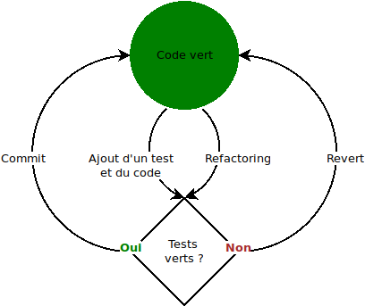

Coding dojo sur la mise en oeuvre de test && commit || revert.

# Approche `test && commit || revert`

Approche *test-driven development* formalisée récemment :
* [test && commit || revert](https://medium.com/@kentbeck_7670/test-commit-revert-870bbd756864) : Kent Beck, 28 septembre 2018 (anglophone, décrit les principes)
* [TCR (test && commit || revert). How to use? Alternative to TDD?](https://medium.com/@tdeniffel/tcr-test-commit-revert-a-test-alternative-to-tdd-6e6b03c22bec) : Thomas Deniffel, 14 novembre 2018 (anglophone, décrit la mise en œuvre de TCR sur un projet pro)
* [ TDD est mort, longue vie TCR ?](https://blog.zenika.com/2018/12/03/tdd-est-mort-longue-vie-tcr/) : Xavier Detant, 3 décembre 2018 (francophone, illustre et décrit la mise en œuvre de TCR, retour d'expérience)

Principe (source : [Xavier Detant](https://blog.zenika.com/2018/12/03/tdd-est-mort-longue-vie-tcr/)) :



# Étapes du coding dojo

Proposition à adapter selon les choix d'organisation.

* choisir un contexte projet "bac-à-sable" comme la programmation de [fizz-buzz](http://codingdojo.org/kata/FizzBuzz/) par exemple

* choisir un langage de programmation commun si la forme le demande (kata [randori](http://www.codingdojo.org/RandoriKata/)) et une suite de test (on doit pouvoir lancer la commande `test`, ou équivalente, pour lancer tous les tests)

* 1er exemple TCR d'échec :
  * développer un test
  * développer la fonction testée avec une erreur volontaire dedans
  * ajouter les modifications en zone de commit (`git add -A`)
  * lancer `(test && commit) || revert`
  * constater l'échec des tests et la suppression du code

* recommencer l'itération sans se tromper 😀

* itérer sur quelques évolutions de code propres au contexte choisi

* implémenter la boucle d'intégration continue (dans le cas de plusieurs équipes qui coderaient en parallèle) :

```sh
while (true) {
    git pull --rebase && test && git push
}
```